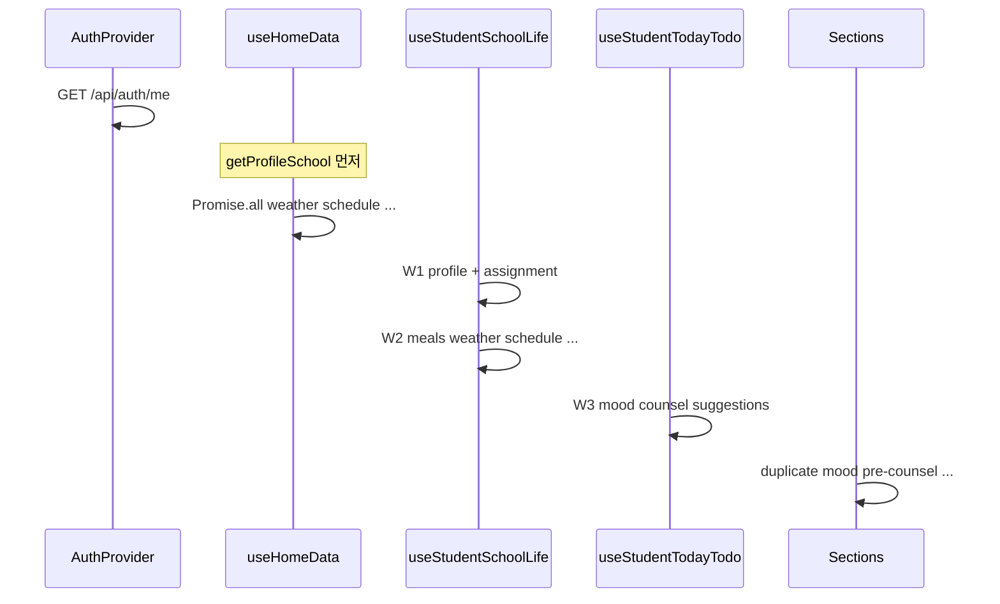

# API 로딩 성능 — Phase 0 베이스라인

- **브랜치:** `feature/api-loading-performance`
- **측정일:** 2026-07-31
- **목적:** Phase 1~4 개선 전 현재 상태 기록 (요청 수, 워터폴, 느린 API, 외부 연동)

---

## 1. 측정 방법

### 1-A. 코드 정적 분석 (완료)

`FN/src` hook·섹션 `useEffect` 기준으로 **최초 진입 시** 호출되는 API를 정리했습니다.

### 1-B. 브라우저 Network Waterfall (수동)

1. Chrome DevTools → Network → **Disable cache**
2. 로그인 후 아래 URL **하드 리로드** (Ctrl+Shift+R)
3. 기록: 요청 **총 개수**, **DOMContentLoaded**, **Load**, Waterfall 스크린샷

| 페이지 | URL | 스크린샷 | 요청 수 | Load 완료 |
|--------|-----|----------|---------|-----------|
| 학교 홈 | `/home` | _(TODO)_ | _(TODO)_ | _(TODO)_ |
| 학생 홈 | `/student` | _(TODO)_ | _(TODO)_ | _(TODO)_ |
| 교사 홈 | `/teacher` | _(TODO)_ | _(TODO)_ | _(TODO)_ |

### 1-C. API 엔드포인트 순차 타이밍 (스크립트)

BN 서버(`localhost:8081`) 기동 후:

```powershell
cd FN
$env:API_BASE="http://localhost:8081"
$env:STUDENT_USER="<학생 아이디>"
$env:STUDENT_PASS="<비밀번호>"
$env:TEACHER_USER="<교사 아이디>"
$env:TEACHER_PASS="<비밀번호>"
node scripts/measure-api-baseline.mjs
```

출력의 **Slow API Top 5**를 아래 §3 표에 붙여 넣습니다.

> **2026-07-31:** 로컬 BN 미기동으로 런타임 수치는 미채움. 서버 기동 후 스크립트 재실행 필요.

### 1-D. 백엔드 외부 API 구간

`WeatherApiClient` — 기상청 **2회** (초단기실황 + 단기예보, 순차).  
`NeisApiClient` — 급식·학사일정·시간표.  
**Phase 1:** Caffeine `@Cacheable` (날씨 15분, NEIS 30분 TTL).

서버 기동 시 로그 레벨 `DEBUG` 또는 AOP 타이밍 추가 후 외부 호출 ms 기록 권장.

---

## 2. 페이지별 API 호출 맵 (정적)

### 공통 (앱 부트)

| 순서 | API | 비고 |
|------|-----|------|
| 1 | `GET /api/auth/me` | `AuthProvider` — 페이지 데이터 전에 대기 |

### 공통 (로그인 후 전 화면)

| API | 비고 |
|-----|------|
| `GET /api/common/announcements?page=0&size=10` | `PlatformAnnouncementProvider` |

---

### 학교 홈 (`/home`) — `useHomeData`

**워터폴:** `getProfileSchool` **선행** → 이후 `Promise.all`

| 단계 | API | 외부 |
|------|-----|------|
| 0 | `GET /api/student|teacher/profile/school` | DB |
| 1 | `GET /api/common/weather/today` | 기상청 |
| 1 | `GET /api/common/school-schedule/upcoming?days=14` | NEIS |
| 1 (학생) | `GET /api/student/meals/today` | NEIS |
| 1 (학생) | `GET /api/student/timetable/today` | NEIS |
| 1 (교사) | `GET /api/counseling/unread-count` | DB |
| 1 (교사) | `GET /api/counseling/teacher` | DB |
| 1 (교사) | `GET /api/teacher/pre-counseling-profiles` | DB |

**학생 역할 학교 홈:** 최소 **1 + 4 + 1(공지) + 1(auth)** ≈ **7건** (순차 구간 포함)  
**교사 역할 학교 홈:** 최소 **1 + 2 + 3 + 1 + 1** ≈ **8건**

---

### 학생 홈 (`/student`)

#### Hook 계층

| 단계 | 소스 | API | 비고 |
|------|------|-----|------|
| W1 | `useStudentSchoolLife` | `profile/school`, `assignment` | 병렬 |
| W2 | ↑ | `meals`, `weather`, `schedule`, `timetable`, `notices`* | W1 **후** 병렬, *담당 교사 있을 때 |
| W3 | `useStudentTodayTodo` | `mood/today`, `pre-counsel`, `counseling/my`, `suggestions` | W2 **후** 병렬 |

#### 섹션 마운트 (W3와 **중복**)

| 섹션 | API |
|------|-----|
| `SectionMood` | `GET /api/student/mood/today` ← **중복** |
| `SectionClassProfile` | `GET /api/student/profile/class` |
| `SectionPreCounsel` | `GET /api/student/pre-counseling-profile` ← **중복** |
| `SectionSuggestion` | `GET /api/student/suggestions` ← **중복** |
| `SectionCounselList` | `GET /api/counseling/my` ← 탭 활성 시 **중복** |
| `SectionAssignment` | `GET /api/student/assignment` ← 패널 열릴 때 **중복** |

**학생 홈 1차 로드 추정:** auth + 공지 + W1(2) + W2(4~5) + W3(4) + 섹션(4~5) ≈ **16~20 HTTP 요청**  
**중복 최소 4건:** mood, pre-counsel, suggestions, counseling/my

---

### 교사 홈 (`/teacher`)

#### Hook

| 소스 | API |
|------|-----|
| `useTeacherDashboard` (병렬 4) | `unread-count`, `counseling/teacher`, `pre-counseling-profiles`, `suggestions` |

#### 섹션 마운트 (대시보드와 **중복**)

| 섹션 | API |
|------|-----|
| `SectionCounselWorkspace` | `GET /api/counseling/teacher` ← **중복** |
| `SectionPreCounselRead` | `GET /api/teacher/pre-counseling-profiles` ← **중복** |
| `SectionSuggestion` | `GET /api/teacher/suggestions` ← **중복** |
| `SectionNotificationSettings` | `notification-settings` |
| `SectionInviteCode` | `invite-code` |
| `SectionNoticeBoard` | `notices` |
| `SectionMoodSummary` | `mood/today`, `mood/weekly` |

**교사 홈 1차 로드 추정:** auth + 공지 + dashboard(4) + 섹션(7) ≈ **13~15건**  
**중복 3건:** counseling/teacher, pre-counsel-profiles, suggestions

---

## 3. Slow API Top 5 (런타임 — TODO)

| 순위 | API | p50 (ms) | p95 (ms) | 외부 | 비고 |
|------|-----|----------|----------|------|------|
| 1 | _(스크립트 실행 후 기입)_ | | | | |
| 2 | | | | | |
| 3 | | | | | |
| 4 | | | | | |
| 5 | | | | | |

**코드상 예상 후보 (캐시 없을 때):**

1. `GET /api/common/weather/today` · `GET /api/student/weather/today` — 기상청 2 hop  
2. `GET /api/student/meals/today` — NEIS  
3. `GET /api/common/school-schedule/upcoming` — NEIS  
4. `GET /api/student/timetable/today` — NEIS  
5. `GET /api/counseling/teacher` / `GET /api/counseling/my` — 목록·조인 (DB)

---

## 4. 워터폴 요약 (개선 Phase 2 타깃)



---

## 5. Phase 0 체크리스트

- [x] 페이지별 API 호출 맵 (정적)
- [x] 중복·워터폴 목록
- [x] 측정 스크립트 `FN/scripts/measure-api-baseline.mjs`
- [ ] 브라우저 Network Waterfall 캡처 (3 페이지)
- [ ] 스크립트 런타임 Top 5 ms 기록
- [ ] 백엔드 외부 API 구간 로그 ms

---

## 6. Phase 1 — 백엔드 외부 API 캐시 (완료)

| 항목 | 구현 |
|------|------|
| 캐시 엔진 | Caffeine (in-memory), `ExternalApiCacheConfig` |
| TTL | 날씨 15분, NEIS 30분 (`ondo.cache.external.*`) |
| 대상 | `WeatherApiClient.fetchTodayWeather`, `NeisApiClient` meals/schedule/timetable |
| 날씨 병렬 | 초단기실황 + 단기예보 `CompletableFuture.supplyAsync` |
| 로깅 | `[cache HIT/MISS] {cacheName} key=…` (debug, `logging-enabled`) |

---

## 7. Phase 2 — 프론트 워터폴·중복 제거 (완료)

| 항목 | 변경 |
|------|------|
| `useHomeData` | `getProfileSchool`을 `Promise.all`에 포함 (선행 워터폴 제거) |
| `useStudentSchoolLife` | W1+W2+W3 → **단일 병렬** (+ 담당 교사 있을 때 notices 1회) |
| `useStudentTodayTodo` | API 호출 제거, `schoolLife` 상태에서 todo만 derive |
| 학생 섹션 | mood / pre-counsel / suggestions / counsel-list → **prefetch props** (중복 fetch 제거) |
| `useTeacherDashboard` | 상담·사전상담·건의 **전체 목록** 보관 |
| 교사 섹션 | workspace / pre-counsel / suggestion → dashboard prefetch **동기화** |

**1차 로드 HTTP 추정 (중복 제거 후):**

| 페이지 | 이전 | 이후 |
|--------|------|------|
| 학교 홈 (학생) | ~7 (순차 구간) | ~6 (전부 병렬) |
| 학생 홈 | ~16–20 | ~11–12 (+ class-profile 1) |
| 교사 홈 | ~13–15 | ~10–11 |

**다음 (Phase 3+):** BFF aggregate (`/api/student/home`), React Query, BN 기동 후 재측정
